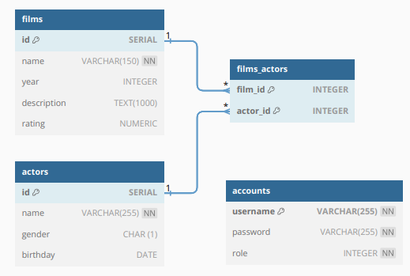

# Film-Library-API

Это прототип бэкенд приложения, которое предоставляет REST API для управления базой данных фильмов.

## Запуск

Для запуска окружения с работающим приложением и базой данных введите следующую команду:

```bash
make run
```

Сервер будет доступен по адресу `localhost:8080`.

## API Спецификация

В файле `film-library-api.yaml` предоставлена спецификация API в формате Swagger 2.0.

## Инструкция по проверке работы сервера

### Получение JWT токена

Чтобы получить токен администратора, выполните GET запрос по адресу:

```bash
curl -X GET "localhost:8080/authenticate?username=admin&password=admin_password"
```
Для роли пользователя используйте имя пользователя `user` и пароль `user_password`.

### Использование JWT токена

Полученный токен необходимо использовать в хедере запросов к серверу, например:

```bash
curl -X PUT -H "X-Auth-Token: jwtToken" -H "Content-Type: application/json" -d '{"id":1,"year":1920}' http://localhost:8080/films
```

Замените `jwtToken` на полученный токен.

### GET запросы с параметрами

Для выполнения GET запросов к маршрутам `/films` и `/actors` доступны следующие GET-параметры:

#### Общие параметры

- `limit`: Количество элементов на странице (по умолчанию **5**)
- `offset`: Смещение (по умолчанию **0**)

#### Параметры для фильмов

Дополнительно для запросов к маршруту `/films`:

- `search`: Поиск фильма по названию или имени актёра
- `sort`: Поле для сортировки (`name`, `rating`, `year`)
- `order`: Направление сортировки (`asc`, `desc`)

### Примеры запросов

#### Добавление фильма

```bash
curl -X POST -H "X-Auth-Token: jwtToken" -H "Content-Type: application/json" -d '{"name":"Dune: Part Two","year":2024,"description":"sci-fi, action, drama, adventure","rating":8.6,"actors":[2,3]}' http://localhost:8080/films
```

#### Добавление актёра

```bash
curl -X POST -H "X-Auth-Token: jwtToken" -H "Content-Type: application/json" -d '{"name":"Matthew Paige Damon","gender":"M","birthday":"1960-10-08"}' http://127.0.0.1:8080/actors
```

## Детали реализации

- Язык реализации: **Go**
- Хранение данных: **PostgreSQL**
- Логирование: Стандартный логгер
- HTTP сервер: Стандартная библиотека `http`
- Авторизация: **JWT (JSON Web Tokens)**
- Запуск окружения: Docker Compose
- Запуск тестов: `make test`

## Планы на будущее

- Вынести настройки базы данных в файл конфигурации
- Обновить логгер для более расширенных возможностей
- Увеличить покрытие тестами для повышения надежности кода
- Реализовать более детальную обработку ошибок для улучшения отладки и обслуживания

## Схема БД


